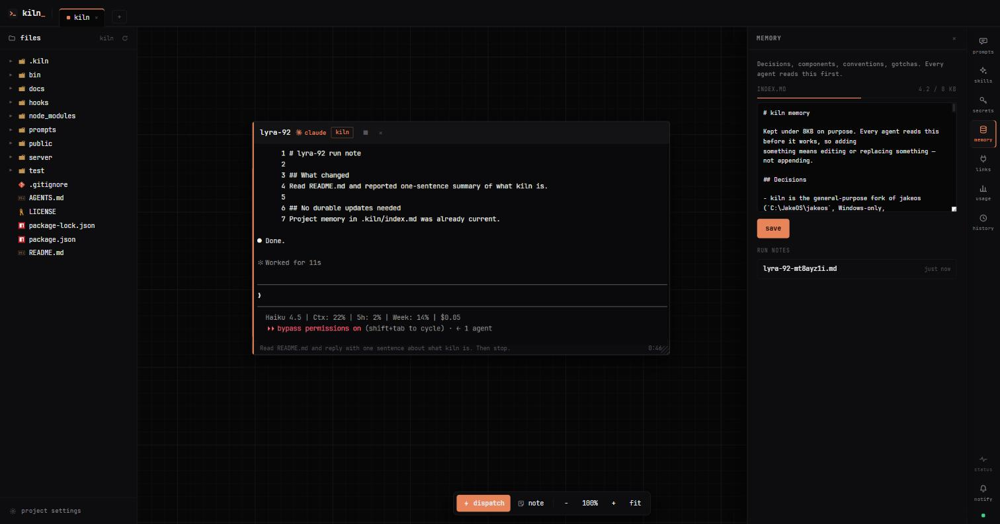

<p align="center">
  
</p>

<h1 align="center">kiln</h1>

<p align="center">Your coding agents, working side by side, on one canvas.</p>

<p align="center">
  <a href="#install">Install</a> ·
  <a href="AGENTS.md">Setup guide</a> ·
  <a href="#what-it-is">What it is</a> ·
  <a href="#day-to-day">Day to day</a>
</p>

<p align="center"><sub>macOS, Linux and Windows · Claude Code and Codex · MIT</sub></p>

<p align="center">
  
</p>

## What it is

Give an agent a job and it opens as a card on the canvas: a real terminal you
can type into, sitting next to every other agent you have running. You can see
which ones are working, which finished, and which are waiting on you, without
clicking through tabs to find out.

Everything an agent needs is set up once and shared by all of them. Your
projects, your API tokens, your MCP connections, and a short memory file per
project that holds what was decided and why.

## Install

You need [Node 20+](https://nodejs.org) and at least one agent CLI, either
[Claude Code](https://claude.com/claude-code) or Codex. Then:

```
npm install -g echoo19/kiln
kiln
```

That opens the canvas in your browser. Run `kiln` again any time to bring the
window back. It never starts a second copy.

The first run is empty. Click **+** in the top bar to add a project folder, then
**dispatch** to send your first agent at it.

You can also hand the setup to an agent you already have. Open Claude Code or
Codex and say *"read AGENTS.md in this repo and set kiln up for me"*. It
installs what is missing, checks the logins, and tells you what needs your
hands.

## Day to day

- **dispatch** at the bottom starts an agent on the selected project.
- Drag cards around, resize them, scroll to zoom. Terminals stay live.
- The rail on the right holds your prompts, skills, tokens, memory,
  connections, usage and history.
- Agents on the same project know about each other: each is told who else is
  there, and can run `kiln who` and `kiln msg <codename> "..."` from its card.
- Closing the window leaves your agents running. `kiln` brings it back.

## Where your things live

| | |
|---|---|
| `~/.kiln` | projects, tokens, notes, the cards from your last session |
| `<project>/.kiln/index.md` | what agents on that project should know before they start |
| `~/projects` | the folder the **+** picker lists (change it with `KILN_PROJECTS_ROOT`) |

Tokens you paste are written to a file on your own machine and loaded into
terminals. They are never shown back to the browser and never sent anywhere.

## More

[AGENTS.md](AGENTS.md) is the full setup and connection guide. It is written for
an agent to follow, and it reads fine if you would rather do it yourself.
